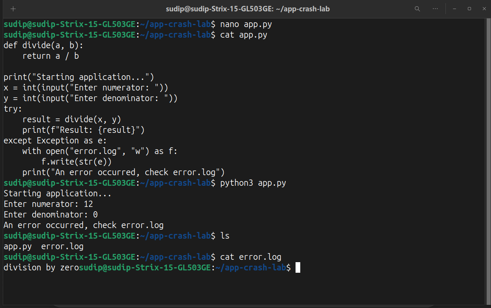
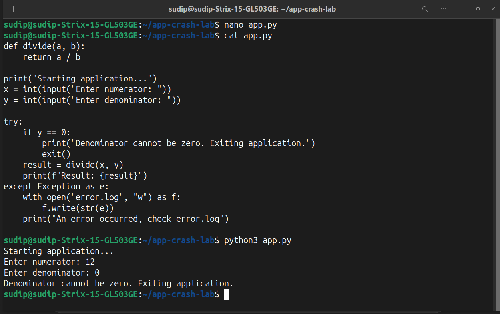

# Application Crash

## What was simulated
A simple Python application was run that crashes when a division by zero occurs. This simulates a runtime application error in real-world scenarios.

## Observations
- Application crashed with `ZeroDivisionError` when denominator = 0
- Terminal output clearly shows the cause of error

## Investigation / Steps Taken
1. Read the traceback to identify the failing line
2. Checked input values causing the crash
3. Confirmed no other system issues contributed

## Resolution
- Added validation to prevent division by zero
- Re-ran application → no crash
- Confirmed expected behavior

## Lessons Learned
- Always validate user input to prevent runtime errors
- Reading error messages carefully is key to troubleshooting
- Logging errors helps track and resolve issues in production environments
