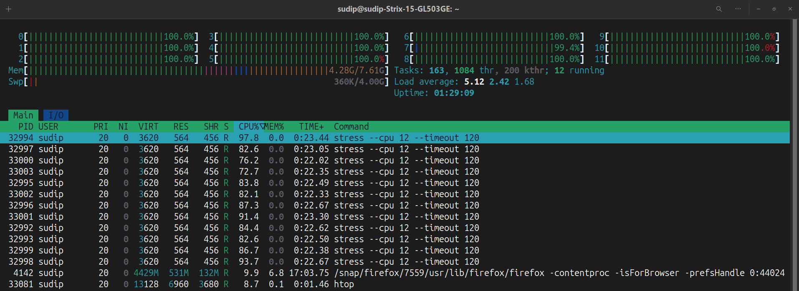
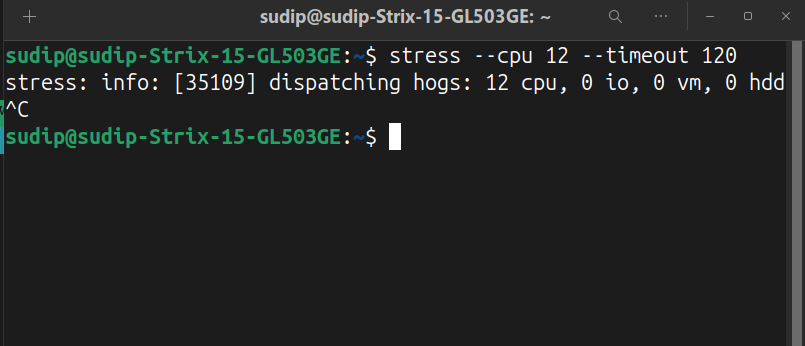
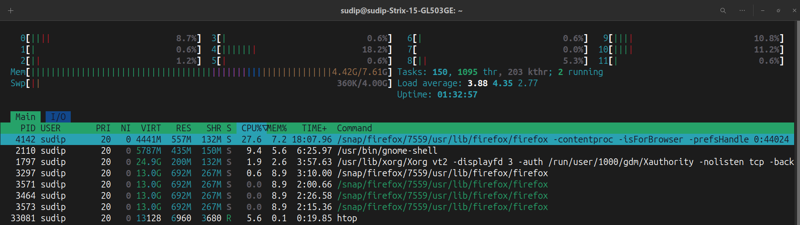

# High CPU / Memory Spike

## What was simulated
A CPU-intensive workload was run on the system using the `stress` tool to simulate high CPU usage. This scenario demonstrates how CPU saturation can impact system performance and service availability.

## Observations
- CPU usage spiked to near 100% across all cores during the experiment.
- System responsiveness slowed temporarily (commands took longer, applications lagged).
- Terminal running the `stress` command confirmed the workload.

## Investigation / Steps Taken
1. Opened `htop` to monitor CPU usage in real time.
2. Identified that all cores were at near maximum utilization.
3. Confirmed that no other applications were causing the high CPU load.

## Resolution
- Stopped the `stress` process using `Ctrl + C`.
- Verified CPU usage returned to normal in `htop`.
- Confirmed system responsiveness returned to normal.

## Lessons Learned
- High CPU usage can significantly impact service responsiveness.
- Monitoring tools such as `htop` are essential to detect and investigate spikes.
- Having procedures to identify and terminate resource-heavy processes is crucial in real-world operations.
