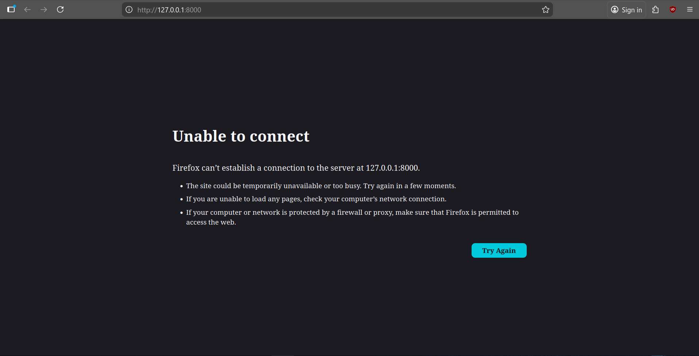
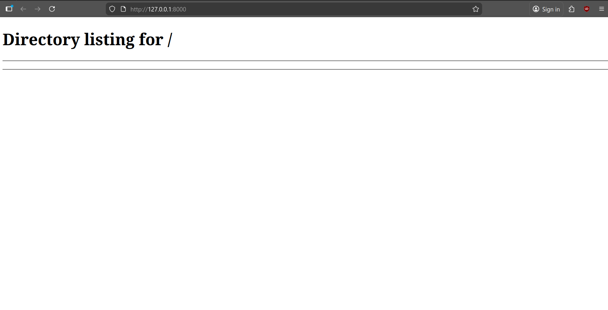

# Web Service Down

## What was simulated
A local Python web server was stopped to simulate a service outage.

## Observations
- Browser error: `Unable to connect`
- Terminal shows the server is stopped
- Attempted access with `curl` confirms service is unavailable

## Investigation / Steps Taken
1. Verified the server process was stopped
2. Confirmed port 8000 was not responding
3. Checked for any firewall issues (none found)

## Resolution
- Restarted the Python HTTP server
- Verified service availability in browser and via `curl`

## Lessons Learned
- Stopping a service immediately makes it unavailable
- Monitoring tools can help detect service downtime
- Always have a restart procedure ready
